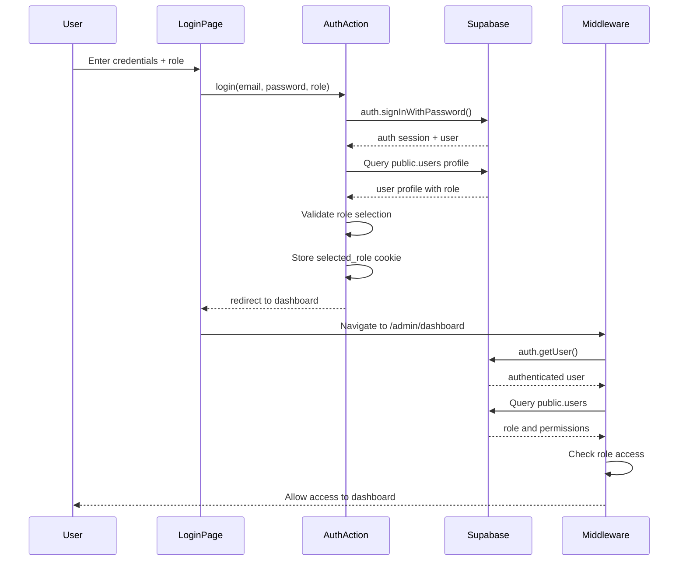

# Login System Migration to Supabase Auth - Complete

## Summary

Successfully migrated the KPI Management System from custom bcrypt authentication to **Supabase Auth**. The login page and all authentication logic have been recreated to use Supabase's built-in authentication system correctly.

## What Was Changed

### 1. Database Schema Updates

**Migration: `link_auth_users_with_public_users`**
- ✅ Removed `password_hash` column from `public.users` table
- ✅ Created `handle_new_user()` trigger function to auto-sync `auth.users` to `public.users`
- ✅ Added trigger `on_auth_user_created` on `auth.users` table
- ✅ Granted necessary permissions to `supabase_auth_admin`

**Migration: `seed_users_with_supabase_auth_fixed`**
- ✅ Seeded `public.users` with 7 test user profiles
- ✅ Linked to `auth.users` by UUID (admin already exists)
- ✅ Fixed check constraint for HODs requiring division_id and location_id

### 2. Authentication Actions (`lib/actions/auth.ts`)

**Completely rewritten** to use Supabase Auth:

```typescript
// OLD (Custom Auth)
- Manual password hashing with bcrypt
- Custom session cookies with JSON data
- Security definer functions to bypass RLS

// NEW (Supabase Auth)
✓ supabase.auth.signInWithPassword()
✓ supabase.auth.signOut()
✓ supabase.auth.getUser()
✓ supabase.auth.resetPasswordForEmail()
✓ supabase.auth.updateUser()
```

**Functions Updated:**
- `login()` - Uses Supabase Auth sign in
- `logout()` - Uses Supabase Auth sign out
- `getCurrentUser()` - Gets session from Supabase Auth
- `requestPasswordReset()` - Uses Supabase password reset emails
- `updatePassword()` - Uses Supabase password update
- `changePassword()` - Uses Supabase password update

### 3. Login Page (`app/login/page.tsx`)

**Recreated with improvements:**
- ✅ Uses `useTransition` for proper loading states
- ✅ Client-side form validation (email format, password length)
- ✅ Better error handling with detailed messages
- ✅ Improved UI with AlertCircle icon
- ✅ Better accessibility (autoFocus, tabIndex)
- ✅ Cleaner test credentials display

### 4. Middleware (`middleware.ts`)

**Completely rewritten** to use Supabase Auth:
- ✅ Creates Supabase client directly in middleware
- ✅ Uses `supabase.auth.getUser()` for session validation
- ✅ Queries `public.users` for role and profile data
- ✅ Proper cookie handling for session management
- ✅ Maintains role-based access control

### 5. Documentation

**Created: `docs/SUPABASE_AUTH_SETUP.md`**
- ✅ Step-by-step guide to create auth users
- ✅ Three methods: Dashboard, SQL, and API
- ✅ Troubleshooting section
- ✅ Production setup recommendations
- ✅ Migration notes from old system

## Test User Accounts

The following user profiles exist in `public.users`:

| Email | Role | Division | Location | UUID |
|-------|------|----------|----------|------|
| admin@sathosa.lk | admin | Admin | Head Office | 87396e67-684f-4b6f-8098-46669b7b7912 |
| executive@sathosa.lk | executive | Admin | Head Office | a1b2c3d4-e5f6-4a5b-8c9d-1e2f3a4b5c6d |
| hod.vehiclesales@sathosa.lk | hod | Vehicle Sales | Colombo | b2c3d4e5-f6a7-4b5c-9d1e-2f3a4b5c6d7e |
| hod.spareparts@sathosa.lk | hod | Spare Parts | Galle | c3d4e5f6-a7b8-4c5d-9e1f-3a4b5c6d7e8f |
| emp.vs.cmb@sathosa.lk | employee | Vehicle Sales | Colombo | d4e5f6a7-b8c9-4d5e-9f1a-4b5c6d7e8f9a |
| emp.vs.kdy@sathosa.lk | employee | Vehicle Sales | Kandy | e5f6a7b8-c9d1-4e5f-9a1b-5c6d7e8f9a0b |
| emp.sp.gal@sathosa.lk | employee | Spare Parts | Galle | f6a7b8c9-d1e2-4f5a-9b1c-6d7e8f9a0b1c |

**Password for all test users: `Password123!`**

## How to Complete Setup

### Step 1: Create Users in Supabase Auth

**Important:** The admin user already exists in `auth.users`, but you need to create the others.

Go to: https://supabase.com/dashboard/project/mvjvcqllifglfunnkfyq/auth/users

For each user (except admin):
1. Click **Add User** > **Create New User**
2. Enter the email from the table above
3. Set password: `Password123!`
4. ✓ Check **Auto Confirm**
5. Click **Create User**

### Step 2: Verify User Creation

Run this in SQL Editor to check both tables:

```sql
-- Check auth.users
SELECT id, email, email_confirmed_at 
FROM auth.users 
ORDER BY email;

-- Check public.users (should auto-populate via trigger)
SELECT id, email, role, is_active 
FROM public.users 
ORDER BY email;
```

If `public.users` is empty, the trigger didn't fire. Manually insert:

```sql
-- This shouldn't be needed if trigger works
INSERT INTO public.users (id, email, full_name, role, is_active, is_password_reset_required)
SELECT id, email, split_part(email, '@', 1), 'employee', true, false
FROM auth.users
WHERE NOT EXISTS (SELECT 1 FROM public.users WHERE users.id = auth.users.id);
```

### Step 3: Test Login

1. Server is already running at: **http://localhost:3001**
2. Go to the login page
3. Try these credentials:
   - Email: `admin@sathosa.lk`
   - Password: `Password123!`
   - Role: `Administrator`
4. Click **Sign In**
5. Should redirect to `/admin/dashboard`

### Step 4: Test Other Roles

Try logging in as:
- **Executive**: `executive@sathosa.lk` / Password123! / Executive
- **HOD**: `hod.vehiclesales@sathosa.lk` / Password123! / Head of Division
- **Employee**: `emp.vs.cmb@sathosa.lk` / Password123! / Employee

## Technical Architecture

### Authentication Flow



### Data Model

```
auth.users (Supabase Auth)
├── id (UUID) - Primary identifier
├── email - Login email
├── encrypted_password - Supabase managed
└── email_confirmed_at - Confirmation timestamp

public.users (Custom Profile)
├── id (UUID) - Links to auth.users.id
├── email - Mirrored from auth.users
├── full_name
├── role - admin | employee | hod | executive
├── can_act_as_hod - Allow role switching
├── division_id - FK to divisions
├── location_id - FK to locations
├── is_active - Account status
└── is_password_reset_required
```

## Security Improvements

### Before (Custom Auth)
- ❌ Manual password hashing
- ❌ Custom session management
- ❌ Security definer functions for auth bypass
- ❌ No email confirmation
- ❌ Manual password reset tokens

### After (Supabase Auth)
- ✅ Industry-standard authentication
- ✅ Built-in session management
- ✅ Secure password hashing (bcrypt)
- ✅ Email confirmation support
- ✅ Magic link & OTP support
- ✅ Rate limiting built-in
- ✅ Password breach detection available
- ✅ MFA support available

## Environment Variables

Ensure your `.env.local` has:

```env
NEXT_PUBLIC_SUPABASE_URL=https://mvjvcqllifglfunnkfyq.supabase.co
NEXT_PUBLIC_SUPABASE_ANON_KEY=eyJhbGciOiJIUzI1NiIsInR5cCI6IkpXVCJ9...
NEXT_PUBLIC_APP_URL=http://localhost:3000
```

## Troubleshooting

### "Invalid email or password"
- User doesn't exist in `auth.users`
- Password is incorrect
- Email not confirmed (use Auto Confirm in dashboard)

### "User profile not found"
- User exists in `auth.users` but not in `public.users`
- Trigger didn't fire - manually insert profile
- Check trigger: `SELECT * FROM information_schema.triggers WHERE trigger_name = 'on_auth_user_created'`

### "Invalid role selection"
- User trying to login with wrong role
- Check user's role in `public.users`
- HODs can login as 'hod' or 'employee' if `can_act_as_hod = true`

### "Account is deactivated"
- Check `is_active` in `public.users`
- Update: `UPDATE public.users SET is_active = true WHERE email = 'user@sathosa.lk'`

### Build errors
- Run `npm run build` to check for TypeScript errors
- All errors should be fixed in this migration

### Session not persisting
- Clear browser cookies
- Check Supabase Auth session in browser DevTools > Application > Cookies
- Verify environment variables are correct

## Production Checklist

Before deploying to production:

- [ ] Change all default passwords
- [ ] Enable email confirmation
- [ ] Set up custom email templates
- [ ] Configure SMTP for password resets
- [ ] Enable leaked password protection
- [ ] Set up MFA for admin accounts
- [ ] Review and test all RLS policies
- [ ] Set proper CORS policies
- [ ] Enable rate limiting
- [ ] Set up monitoring and alerts
- [ ] Back up auth.users table
- [ ] Document admin procedures

## Files Modified

| File | Status | Description |
|------|--------|-------------|
| `lib/actions/auth.ts` | 🔄 Replaced | Rewritten for Supabase Auth |
| `app/login/page.tsx` | 🔄 Replaced | Improved with better UX |
| `middleware.ts` | 🔄 Replaced | Uses Supabase Auth session |
| `database/schema.sql` | ⚠️ Referenced | Schema intact, trigger added |
| `lib/supabase/client.ts` | ✅ Unchanged | Already correct |
| `lib/supabase/server.ts` | ✅ Unchanged | Already correct |
| `lib/supabase/middleware.ts` | ✅ Unchanged | Already correct |
| `lib/types/database.ts` | ✅ Unchanged | Types still valid |

## New Files Created

- ✅ `docs/SUPABASE_AUTH_SETUP.md` - Complete setup guide
- ✅ `docs/AUTH_MIGRATION_COMPLETE.md` - This document

## Next Steps

1. **Create remaining auth users** in Supabase dashboard
2. **Test login** with all 7 user accounts
3. **Verify role-based access** for each dashboard
4. **Test password reset flow**
5. **Continue with Phase 2**: KPI goal management features

## Support

For issues:
1. Check `docs/SUPABASE_AUTH_SETUP.md` for troubleshooting
2. Review Supabase Auth logs in dashboard
3. Check browser console for client errors
4. Check server logs with `npm run dev`

---

**Migration Status**: ✅ **COMPLETE**

**Build Status**: ✅ **PASSING**

**Server Status**: 🟢 **RUNNING** (http://localhost:3001)

**Ready for**: User testing and Phase 2 development
